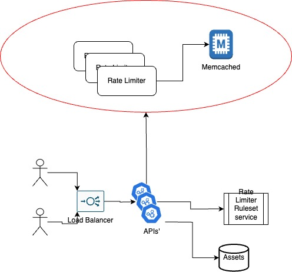
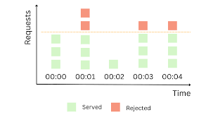

# Rate Limiter - Fixed Window Counter

### Description
This repository contains the implementation of a Rate Limiter for APIs'.  
While there are multiple algorithms and approaches to implement Rate Limiter, the approach implemented here called [Fixed Window Counter](https://blog.bytebytego.com/i/124962528/fixed-window-counter).  

Other approaches which exists are [Sliding Window Counter](https://blog.bytebytego.com/i/124962528/sliding-window-counter), [Sliding Window Log](https://blog.bytebytego.com/i/124962528/sliding-window-log), [Token bucket](https://blog.bytebytego.com/i/124962528/token-bucket) and [Leaky Bicket](https://blog.bytebytego.com/i/124962528/leaky-bucket)

### High Level Diagram
The diagram below illustrate the role and location of the Rate Limiter in the overall system:

### Fixed Window Counter
This algorithm is simple as it sounds:
- A fixed window of time is predefined, such 1 minute / 30 seconds / 1 hour etc.
- A maximum requests allowed per window is predefined.
- For each unique identifier (such username/api-token/ip/device-id) the algorithm keep in database a counter for the number of requests, and timestamp of the start of the window.
- For each request:
    - Checks if the identifier exists.
        - If yes, it checks if request arrived during the current open fixed window. 
            - If yes, it checks if maximum requests allowed exhausted.
                - If yes: Request rejected.
            - Else: request allowed.
        - Else: it reset the counter, and allow the request.
    - Save the identifier with timestamp and allow the request.
- The database used to save the unique id and the timestmap is [Memcached](https://memcached.org/)

Below is a diagram that illustrate the flow:

### Repository Assets
The implementation in this repository includes the following parts:
- Rate Limiter [service](src/ratelimit_memcached.py)
- Unit tests [code](src/test/test_ratelimit_memcached.py)
- API [endpoints](src/main.py): 
    - `GET /ratelimit`  - Return False if request allowed, Return True if request is blocked.
    - `GET /checkbalance` - Return key and number of requests allowed in the current fixed window.
- [Dockerfile](src/Dockerfile-memcached) to containerize the service
- [docker-compose](src/docker-compose-memcached.yaml) for distributed deployment, including Memcached deployment.
- K8s [manifests](k8s) for distributed deployment **
- Load Test [script](loadtest/loadtest.py).
- [Actions](.github/workflows) for linting, unit-test, container image build and distribution to container images registry.
- [Setup](.devcontainer) for Github Codespaces, including tools for test and deploy such docker, docker-compose, kind, pytest, apache-benchmark etc. 

\** *Work in progress*

### Deployment
Development and test conducted in Github Codespaces. 
I found it to be more convenient to use a tool such docker-compose to test distributed deployment of the service integrated with memcached DB.  

Similar deployment can be done using kind cluster, to simulate deplyment into k8s cluster.  
\**At this point of time, more work is required here, to deploy the memcached DB and integrate it with the rate limiter service*

### Functional Tests
Basic use-cases are covered. (*There is still room for improvement here*). 

### Load Tests
I used two methods for load test:
- [Apache Benchmark](https://httpd.apache.org/docs/current/programs/ab.html)
- [Custom](loadtest/README.md) Load test script

### Assumptions and Open Items
- Ruleset service which define the Rate Limiter rules is not implemented here. Assumption that this is part of the input to the Rate Limiter Service.
- Distributed deployment of Memcached DB is not in the scope of this repository.
- There is room for improvment by adding more unit-tests (such edge cases, negative input parameters, etc.) and load tests (such uneven load traffic).

## Conclusion
This Rate Limiter implementation provides a scalable API traffic management solution using Fixed Window Counter and Memcached. It features a modular design and decent testing. Future enhancements can include additional algorithms, ruleset integration, and expanded Memcached deployment.
